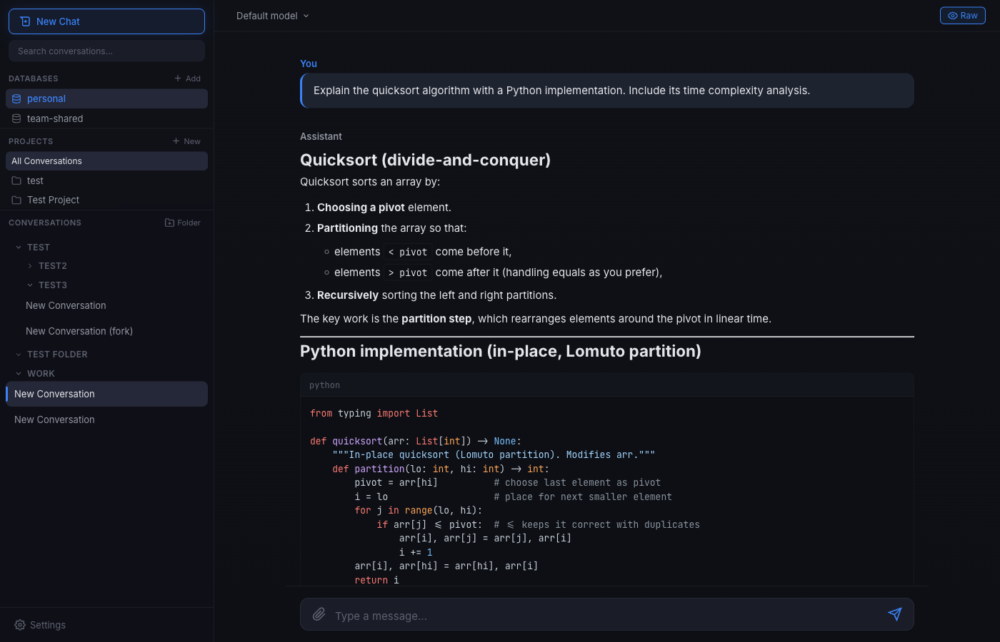
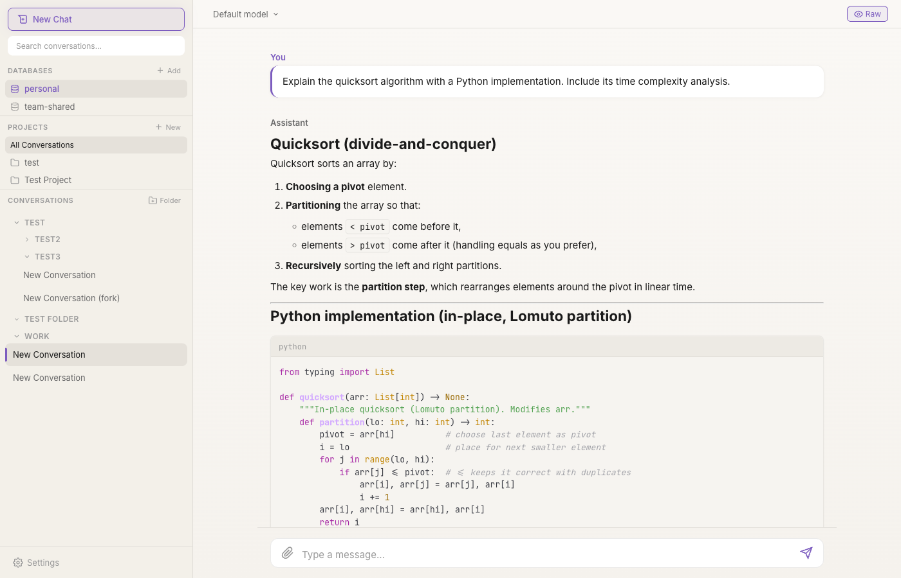
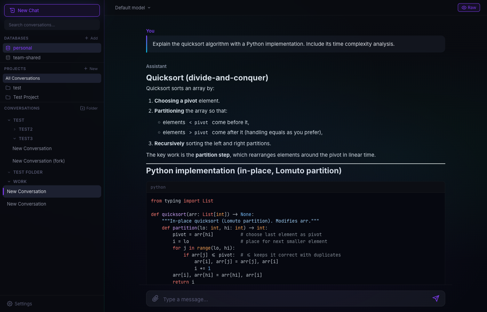
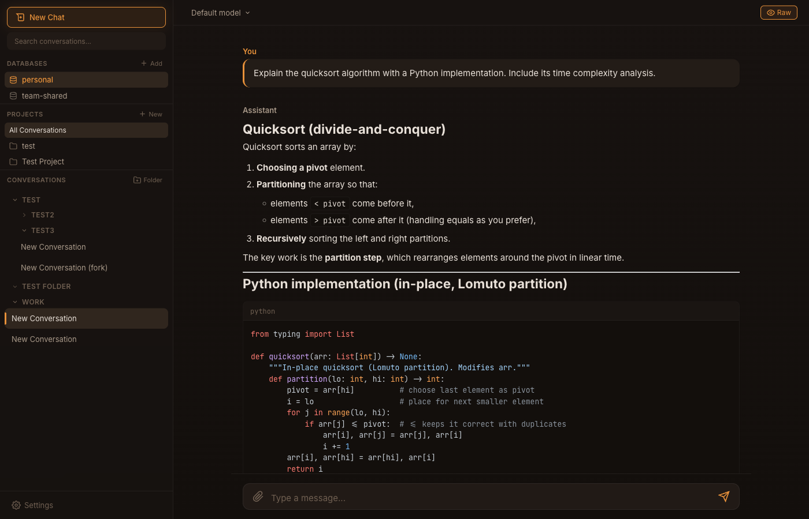

<p align="center">
  
  
  
  
</p>

<h1 align="center">
  <br>
  Parlor
  <br>
</h1>

<h3 align="center">A private parlor for AI conversation.</h3>

<p align="center">
  Self-hosted ChatGPT-style web UI <strong>and</strong> agentic CLI that connects to any OpenAI-compatible API.<br>
  <strong>Install with pip. Run locally. Own your data.</strong>
</p>

<p align="center">
  <a href="#quick-start">Quick Start</a> &bull;
  <a href="#cli-chat-mode">CLI Chat</a> &bull;
  <a href="#features">Features</a> &bull;
  <a href="#themes">Themes</a> &bull;
  <a href="#security">Security</a> &bull;
  <a href="#api-reference">API</a>
</p>

<p align="center">
  
</p>

---

## Why Parlor?

Your company's AI chat UI sucks. You know it. We know it. Parlor replaces it with something you'll actually want to use.

It connects to **any** OpenAI-compatible endpoint --- your company's internal API, OpenAI, Azure, Ollama, LM Studio, or anything else that speaks the OpenAI protocol. Built to [OWASP ASVS L1](SECURITY.md) standards because your conversations deserve real security, not security theater.

> **One command. No cloud. No telemetry. No compromise.**

```bash
pip install parlor
```

---

## Quick Start

**1. Install**

```bash
pip install parlor
```

**2. Configure** --- create `~/.ai-chat/config.yaml`:

```yaml
ai:
  base_url: "https://your-ai-endpoint/v1"
  api_key: "your-api-key"
  model: "gpt-4"
```

**3. Verify** your connection:

```bash
parlor --test
```

**4. Launch:**

```bash
parlor          # Web UI
parlor chat     # Terminal CLI
```

Your browser opens to `http://127.0.0.1:8080`. That's it.

---

## CLI Chat Mode

An agentic terminal REPL --- like Claude Code, but connected to **your own API**. Read files, write code, run commands, search your codebase, all from the terminal. Works on macOS, Linux, and Windows.

```bash
parlor chat                     # Interactive REPL
parlor chat "explain main.py"   # One-shot mode
parlor chat -c                  # Continue last conversation
parlor chat -r <id>             # Resume a specific conversation
parlor chat -p /path/to/project # Set project root
parlor chat --no-tools          # Disable built-in tools
```

### How It Works

1. You type a prompt (or pass one as an argument)
2. A **thinking spinner** with elapsed timer shows while the AI works
3. Tool calls (file reads, bash commands, etc.) display inline as they execute
4. The complete response renders with **Rich Markdown** --- syntax-highlighted code blocks, headers, lists, and more
5. A **context footer** shows token usage, response tokens, elapsed time, and remaining space before auto-compact

The AI runs in an **agentic loop**: it can call tools, inspect results, and continue reasoning --- up to 50 iterations per response by default. This means it can tackle multi-step tasks like "find and fix the bug in auth.py" autonomously.

### Built-in Tools

Six tools ship out of the box (no MCP server required):

| Tool | What it does |
|---|---|
| `read_file` | Read file contents with line numbers. Supports `offset` and `limit` for partial reads. Output truncated at 100KB. |
| `write_file` | Create or overwrite files. Parent directories are created automatically. |
| `edit_file` | Exact string replacement. The `old_text` must appear exactly once (unique match required). Use `replace_all=true` for global replacement. |
| `bash` | Run shell commands with configurable timeout (default 120s, max 600s). Returns stdout, stderr, and exit code. Output truncated at 100KB. |
| `glob_files` | Find files matching a glob pattern (e.g., `**/*.py`). Results sorted by modification time. |
| `grep` | Regex search across files with optional context lines and file-type filtering. |

**Safety**: Destructive commands (`rm`, `git push --force`, `git reset --hard`, `drop table`, `chmod 777`, etc.) prompt for confirmation before executing. Path validation blocks access to sensitive system files (`/etc/shadow`, `/proc/`, etc.).

### File References

Reference files and directories directly in your prompt with `@`:

```
you> explain @src/main.py
you> what tests cover @src/auth/
you> compare @old.py and @new.py
you> review @"path with spaces/file.py"
```

- `@file.py` --- inlines the full file contents (truncated at 100KB)
- `@directory/` --- inlines a listing of the directory contents (up to 200 entries)
- `@"quoted path"` --- handles paths with spaces

### Context Management

Parlor tracks token usage across the conversation using **tiktoken** (with a char-estimate fallback):

- **Warning** at 80K tokens --- a hint to `/compact`
- **Auto-compact** at 100K tokens --- automatically summarizes the conversation history to free space
- **Context footer** after each response shows a progress bar, token counts, and remaining headroom

```
  [====----------------] 12,340/128,000 tokens (10%) | response: 482 | 3.2s | 87,660 until auto-compact
```

Use `/compact` at any time to manually summarize and free up context space.

### REPL Commands

| Command | Action |
|---|---|
| `/new` | Start a new conversation |
| `/last` | Resume the most recent conversation |
| `/list` | Show 20 most recent conversations |
| `/resume N` | Resume by list number or conversation ID |
| `/compact` | Summarize and compact message history to free context |
| `/model NAME` | Switch to a different model mid-session |
| `/tools` | List all available tools (built-in + MCP) |
| `/skills` | List available skills with descriptions |
| `/help` | Show all commands and input syntax |
| `/quit`, `/exit` | Exit the REPL |

### Keyboard Shortcuts

| Shortcut | Action |
|---|---|
| `Ctrl+C` | Clear current input. If input is empty, exit. |
| `Ctrl+D` | Exit the REPL |
| `Alt+Enter` | Insert a newline (multiline input) |
| `Tab` | Autocomplete `/commands`, skill names, and `@file` paths |

### Skills

Skills are reusable prompt templates invoked with `/name`. Three ship by default:

| Skill | What it does |
|---|---|
| `/commit` | Inspects `git diff`, stages relevant files, creates a conventional commit (`type(scope): description`) |
| `/review` | Reviews current changes for bugs, security issues, performance concerns, and missing tests |
| `/explain` | Reads referenced code and explains architecture, data flow, and design patterns |

**Custom skills**: Add YAML files to `~/.parlor/skills/` (global) or `.parlor/skills/` (per-project). Project skills override global skills with the same name.

```yaml
name: test
description: Run tests and fix failures
prompt: |
  Run the test suite. If any tests fail, read the failing test
  and the relevant source code, then fix the issue.
```

```yaml
name: deploy
description: Build and deploy to staging
prompt: |
  1. Run the full test suite
  2. Build the production bundle
  3. Deploy to the staging environment
  4. Verify the deployment is healthy
```

### Project Instructions (PARLOR.md)

Create a `PARLOR.md` in your project root to inject context into every conversation:

```markdown
# Project: my-app

## Tech Stack
- Python 3.12, FastAPI, SQLAlchemy
- PostgreSQL 16, Redis 7

## Conventions
- All functions must have type hints
- Use conventional commits
- Tests required for all new features
```

Parlor searches up from the current directory for the nearest `PARLOR.md`. A global `~/.parlor/PARLOR.md` applies to all projects. Both are loaded if found (global first, then project-specific).

### Shared Database

CLI and web UI share the same SQLite database (`~/.ai-chat/chat.db`). Conversations created in the terminal show up in the web sidebar, and vice versa. Titles are auto-generated after the first exchange.

### CLI Configuration

Add a `cli:` section to `~/.ai-chat/config.yaml`:

```yaml
cli:
  builtin_tools: true     # Enable built-in file/bash tools (default: true)
  max_tool_iterations: 50 # Max agentic loop iterations per response (default: 50)
```

MCP servers configured in the same `config.yaml` are available in both CLI and web UI. Built-in tools and MCP tools work together --- the AI can use both in the same response.

---

## Features

### Conversations

| | |
|---|---|
| **Create, rename, search, delete** | Full conversation lifecycle with double-click rename |
| **Full-text search** | FTS5-powered instant search across all messages and titles |
| **Fork at any message** | Branch a conversation into a new thread from any point |
| **Edit & regenerate** | Edit any user message, all subsequent messages are deleted, AI regenerates from there |
| **Export to Markdown** | One-click download of any conversation as `.md` |
| **Auto-titles** | AI generates a title from your first message |
| **Per-conversation model** | Switch models mid-conversation from the top bar dropdown |
| **Copy between databases** | Duplicate an entire conversation (with messages + tool calls) to another database |

### Projects

Group conversations under projects with **custom system prompts** and **per-project model selection**. Your coding project uses Claude with a developer prompt. Your writing project uses GPT-4 with an editorial voice. Each project is its own world.

- Project-scoped system prompt overrides the global default
- Per-project model override (or "use global default")
- Project-scoped folders --- each project gets its own folder hierarchy
- Deleting a project preserves its conversations (they become unlinked, not deleted)
- "All Conversations" view to see everything across projects

### Organization

<table>
<tr>
<td width="50%">

**Folders**
- Nested folder hierarchy with unlimited depth
- Add subfolders from the folder context menu
- Collapse/expand state persists to the database
- Depth-based indentation in the sidebar
- Rename and delete (conversations are preserved, not deleted)
- Project-scoped: each project gets its own folder tree

</td>
<td width="50%">

**Tags**
- Color-coded labels on conversations (hex color picker)
- Create tags inline from any conversation's tag dropdown
- Filter the sidebar by tag
- Visual badges with color indicators
- Delete a tag and it's cleanly removed from all conversations

</td>
</tr>
</table>

### Shared Databases

Connect **multiple SQLite databases** for team or topic-based separation. Each database is fully independent --- its own conversations, attachments, and history.

- **Visual file browser** with directory navigation for selecting `.db`/`.sqlite`/`.sqlite3` files
- **Copy conversations** between databases (full message + tool call history)
- **Switch databases** from the sidebar --- active database is visually indicated
- Database names: letters, numbers, hyphens, underscores only
- "personal" database always exists and can't be removed
- Paths restricted to your home directory for security

### Rich Rendering

| Format | Support |
|---|---|
| **Markdown** | Full GFM --- tables, lists, blockquotes, strikethrough, task lists |
| **Code blocks** | Syntax highlighting via highlight.js with language label + one-click copy button |
| **LaTeX math** | Inline `$x^2$` / `\(x^2\)` and display `$$\int$$` / `\[\int\]` via KaTeX |
| **Images** | Inline previews for attached images |
| **HTML subset** | `<kbd>`, `<sup>`, `<sub>`, `<dl>`/`<dt>`/`<dd>` via DOMPurify allowlist |

### File Attachments

Drag-and-drop or click to attach. **35+ file types** supported. Up to **10 files per message**, **10 MB each**. Every file is verified with magic-byte detection --- a renamed `.exe` won't sneak through as a `.png`.

| Category | Extensions |
|---|---|
| **Code** | `.py` `.js` `.ts` `.java` `.c` `.cpp` `.h` `.hpp` `.rs` `.go` `.rb` `.php` `.sh` `.bat` `.ps1` `.sql` `.css` |
| **Data** | `.json` `.yaml` `.yml` `.csv` `.xml` `.toml` `.ini` `.cfg` `.log` |
| **Documents** | `.txt` `.md` `.pdf` |
| **Images** | `.png` `.jpg` `.jpeg` `.gif` `.webp` |

- Image attachments show inline thumbnails with file size
- Non-image files force-download (never rendered in-browser)
- Filenames are sanitized: path components stripped, special characters replaced

### MCP Tool Integration

Connect **stdio** or **SSE-based** MCP servers. Your AI gains access to external tools --- databases, APIs, file systems, anything with an MCP adapter.

- Tool calls render as **expandable detail panels** --- see input during execution, output + status when complete
- Spinner animation while tools execute
- Connected server count and total tool count shown in sidebar footer
- SSRF protection with DNS resolution and shell metacharacter rejection on tool args

```yaml
mcp_servers:
  - name: "my-tools"
    transport: "stdio"
    command: "npx"
    args: ["-y", "@my-org/mcp-tools"]

  - name: "remote-tools"
    transport: "sse"
    url: "https://mcp-server.example.com/sse"
```

### Streaming

Real-time **token-by-token streaming** via Server-Sent Events.

- Markdown and math render live as tokens arrive
- **Raw mode toggle** (eye icon in top bar) --- view unprocessed text during streaming, persists across sessions
- Stop generation mid-response with `Escape` or the stop button
- Animated thinking indicator with pulsing dots while AI processes
- Error messages show inline with a **Retry** button

### Command Palette

**`Cmd+K`** / **`Ctrl+K`** opens a Raycast-style command palette with fuzzy matching.

| Command type | What it does |
|---|---|
| **New Chat** | Create a fresh conversation |
| **Theme: Midnight / Dawn / Aurora / Ember** | Switch themes instantly |
| **Model names** | Switch the current model (all available models listed) |
| **Project names** | Jump to a project |
| **Recent conversations** | Quick-jump to your 10 most recent chats |

Arrow keys to navigate, `Enter` to select, `Escape` to dismiss.

### Web UI Keyboard Shortcuts

| Shortcut | Action |
|---|---|
| `Cmd/Ctrl + K` | Open command palette |
| `Ctrl + Shift + N` | New conversation |
| `Escape` | Stop generation / close palette / close modal |
| `Enter` | Send message |
| `Shift + Enter` | Newline in message input |

### Settings UI

Click the gear icon in the sidebar to open the settings modal:

- **Model selector** --- dropdown populated live from your API
- **System prompt editor** --- change at runtime, persists to `config.yaml`
- **Theme picker** --- visual cards showing each theme's color palette
- Changes take effect immediately, no restart needed

---

## Themes

Four built-in themes, each with a distinct visual identity. Switch instantly via settings or command palette (`Cmd+K`).

### Midnight `Default`

Premium tech dark --- think Linear, Raycast, Vercel. Deep navy-charcoal with electric blue accents. Glassmorphic sidebar.

<p align="center">
  
</p>

### Dawn `Light`

Warm editorial light --- think Notion in sunlight. Cream backgrounds, soft indigo-violet accents, subtle paper texture.

<p align="center">
  
</p>

### Aurora `Showstopper`

Living gradient dark with animated CSS aurora (purple/teal/emerald). Gradient borders, animated input focus rings.

<p align="center">
  
</p>

### Ember `Cozy`

Warm luxury dark --- amber by firelight. Brown-charcoal backgrounds, rich amber glow on focus states.

<p align="center">
  
</p>

**Visual details:**
- Glassmorphism with `backdrop-filter: blur(20px)` on sidebar
- Multi-layered shadows for depth: `0 1px 2px` + `0 4px 12px`
- Micro-animations: sidebar items shift on hover, buttons glow, modals spring in
- Gradient text effect on welcome heading
- Smooth 0.5s cross-fade transition between themes
- Code block copy button fades in on hover
- Theme persists in localStorage across sessions --- no flash on reload

---

## Responsive Design

| Breakpoint | Target | Behavior |
|---|---|---|
| **1400px+** | Large desktop | Wider messages (900px), expanded sidebar (300px) |
| **769-1399px** | Desktop | Default layout |
| **768-1024px** | Tablet | Compact sidebar (240px), full-width messages |
| **0-767px** | Mobile | Slide-over sidebar with hamburger menu + dark overlay |

Mobile sidebar slides in with `transform` animation. Tap the overlay or hamburger to dismiss.

---

## Configuration

### Config File

`~/.ai-chat/config.yaml`

```yaml
ai:
  base_url: "https://your-ai-endpoint/v1"
  api_key: "your-api-key"
  model: "gpt-4"
  system_prompt: "You are a helpful assistant."
  verify_ssl: true  # set false for self-signed certs

app:
  host: "127.0.0.1"     # bind address
  port: 8080             # server port
  data_dir: "~/.ai-chat" # where DB + attachments live

# Optional: CLI settings
cli:
  builtin_tools: true     # Enable built-in tools (default: true)
  max_tool_iterations: 50 # Max tool calls per response (default: 50)

# Optional: shared databases
shared_databases:
  - name: "team-shared"
    path: "~/shared/team.db"

# Optional: MCP tool servers
mcp_servers:
  - name: "my-tools"
    transport: "stdio"
    command: "npx"
    args: ["-y", "@my-org/mcp-tools"]

  - name: "remote-tools"
    transport: "sse"
    url: "https://mcp-server.example.com/sse"
```

### Environment Variables

Every config option has an env var override:

| Variable | Default | Description |
|---|---|---|
| `AI_CHAT_BASE_URL` | --- | AI API endpoint **(required)** |
| `AI_CHAT_API_KEY` | --- | API key **(required)** |
| `AI_CHAT_MODEL` | `gpt-4` | Model name |
| `AI_CHAT_SYSTEM_PROMPT` | `You are a helpful assistant.` | System prompt |
| `AI_CHAT_VERIFY_SSL` | `true` | SSL certificate verification |

---

## Command Reference

```
parlor              Launch web UI server and open browser
parlor chat         Interactive CLI chat (agentic REPL)
parlor chat "msg"   One-shot mode (run prompt and exit)
parlor chat -c      Continue last conversation
parlor chat -r ID   Resume a specific conversation
parlor chat --no-tools  Disable built-in tools
parlor --test       Test connection, list models, send test prompt
parlor --help       Show help
```

<details>
<summary><strong>Example <code>--test</code> output</strong></summary>

```
Config:
  Endpoint: https://your-ai-endpoint/v1
  Model:    gpt-4
  SSL:      enabled

1. Listing models...
   OK - 12 model(s) available
     - gpt-4
     - gpt-4-turbo
     - gpt-3.5-turbo
     ...

2. Sending test prompt to gpt-4...
   OK - Response: Hello! How can I help you today?

All checks passed.
```

</details>

---

## Security

Parlor is hardened for use on corporate networks and shared machines. Not a checkbox exercise --- real, layered defense.

| Layer | What it does |
|---|---|
| **Authentication** | Random session token, HttpOnly cookies, HMAC-SHA256 timing-safe comparison |
| **CSRF** | Per-session tokens validated on all state-changing requests |
| **CSP** | `script-src 'self'`, `frame-ancestors 'none'`, no inline scripts |
| **Security Headers** | X-Frame-Options DENY, X-Content-Type-Options nosniff, strict Referrer-Policy, Permissions-Policy |
| **Database** | Column-allowlisted SQL builder, parameterized queries everywhere, `0600` file permissions, path validation |
| **Input Sanitization** | DOMPurify on all rendered HTML, UUID validation on all IDs, filename sanitization |
| **Rate Limiting** | 120 req/min per IP with LRU eviction |
| **Body Size** | 15 MB max request |
| **CORS** | Locked to configured origin, explicit method/header allowlist |
| **File Safety** | MIME type allowlist + magic-byte verification, path traversal prevention, forced download for non-images |
| **MCP Safety** | SSRF protection with DNS resolution, shell metacharacter rejection in tool args |
| **SRI** | SHA-384 hashes on all vendor scripts |
| **API Surface** | OpenAPI/Swagger docs disabled |
| **CLI Safety** | Destructive command confirmation, path validation blocks `/etc/shadow`, `/proc/`, etc. |

Full details in [SECURITY.md](SECURITY.md).

---

## Data Storage

Everything stays on your machine. Nothing phones home.

```
~/.ai-chat/
  config.yaml          # Configuration          (permissions: 0600)
  chat.db              # SQLite + WAL journal   (permissions: 0600)
  cli_history           # REPL command history
  attachments/         # Files by conversation  (permissions: 0700)
```

The data directory is created with `0700` permissions (owner-only). Database files are created with `0600` permissions. WAL and SHM sidecar files are locked down too.

---

## API Reference

Parlor exposes a full REST API. All endpoints require authentication via session cookie + CSRF token.

<details>
<summary><strong>Conversations</strong></summary>

| Method | Endpoint | Description |
|---|---|---|
| `GET` | `/api/conversations` | List (with `?search=`, `?project_id=`, `?db=`) |
| `POST` | `/api/conversations` | Create |
| `GET` | `/api/conversations/:id` | Get with messages, attachments, and tool calls |
| `PATCH` | `/api/conversations/:id` | Update title, folder, model |
| `DELETE` | `/api/conversations/:id` | Delete with all attachments |
| `GET` | `/api/conversations/:id/export` | Export as Markdown |
| `POST` | `/api/conversations/:id/chat` | Stream chat (SSE) |
| `POST` | `/api/conversations/:id/stop` | Cancel active generation |
| `POST` | `/api/conversations/:id/fork` | Fork at a message position |
| `POST` | `/api/conversations/:id/copy` | Copy to another database (`?target_db=`) |

</details>

<details>
<summary><strong>Messages & Attachments</strong></summary>

| Method | Endpoint | Description |
|---|---|---|
| `PUT` | `/api/messages/:id` | Edit message content (deletes subsequent messages) |
| `DELETE` | `/api/messages/:id` | Delete messages after a position |
| `GET` | `/api/attachments/:id` | Download attachment file |

</details>

<details>
<summary><strong>Projects</strong></summary>

| Method | Endpoint | Description |
|---|---|---|
| `GET` | `/api/projects` | List all projects |
| `POST` | `/api/projects` | Create project (name, instructions, model) |
| `PATCH` | `/api/projects/:id` | Update name, instructions, or model |
| `DELETE` | `/api/projects/:id` | Delete project (conversations preserved) |

</details>

<details>
<summary><strong>Folders</strong></summary>

| Method | Endpoint | Description |
|---|---|---|
| `GET` | `/api/folders` | List folders (`?project_id=` to filter) |
| `POST` | `/api/folders` | Create folder (name, parent_id, project_id) |
| `PATCH` | `/api/folders/:id` | Update name, parent, collapsed state, position |
| `DELETE` | `/api/folders/:id` | Delete folder + subfolders (conversations preserved) |

</details>

<details>
<summary><strong>Tags</strong></summary>

| Method | Endpoint | Description |
|---|---|---|
| `GET` | `/api/tags` | List all tags |
| `POST` | `/api/tags` | Create tag (name, color) |
| `PATCH` | `/api/tags/:id` | Update name or color |
| `DELETE` | `/api/tags/:id` | Delete tag (removed from all conversations) |
| `POST` | `/api/conversations/:id/tags/:tag_id` | Add tag to conversation |
| `DELETE` | `/api/conversations/:id/tags/:tag_id` | Remove tag from conversation |

</details>

<details>
<summary><strong>Databases</strong></summary>

| Method | Endpoint | Description |
|---|---|---|
| `GET` | `/api/databases` | List all connected databases |
| `POST` | `/api/databases` | Add database (name, path) |
| `DELETE` | `/api/databases/:name` | Remove database connection |
| `GET` | `/api/browse?path=` | Browse filesystem for `.db`/`.sqlite`/`.sqlite3` files |

</details>

<details>
<summary><strong>Config & Models</strong></summary>

| Method | Endpoint | Description |
|---|---|---|
| `GET` | `/api/config` | Get current config + MCP server statuses |
| `PATCH` | `/api/config` | Update model and/or system prompt |
| `POST` | `/api/config/validate` | Test API connection, list models |
| `GET` | `/api/models` | List available models (sorted) |
| `GET` | `/api/mcp/tools` | List all available MCP tools with schemas |

</details>

---

## Development

```bash
git clone https://github.com/troylar/parlor.git
cd parlor
pip install -e ".[dev]"

pytest tests/ -v          # Run 155 tests
ruff check src/ tests/    # Lint
ruff format src/ tests/   # Format
```

### Tech Stack

| | |
|---|---|
| **Backend** | Python 3.10+, FastAPI, Uvicorn |
| **Frontend** | Vanilla JS (no build step), marked.js, highlight.js, KaTeX, DOMPurify |
| **CLI** | Rich, prompt-toolkit, tiktoken |
| **Database** | SQLite with FTS5 full-text search, WAL journaling |
| **AI** | OpenAI Python SDK (async streaming) |
| **MCP** | Model Context Protocol SDK (stdio + SSE transports) |
| **Streaming** | Server-Sent Events (SSE) |
| **Typography** | Inter + JetBrains Mono (self-hosted WOFF2, zero external requests) |
| **Security** | OWASP ASVS L1 compliance, SRI, CSP, CSRF, rate limiting |

---

<p align="center">
  <strong>MIT License</strong><br>
  Built for people who care about their conversations.
</p>
