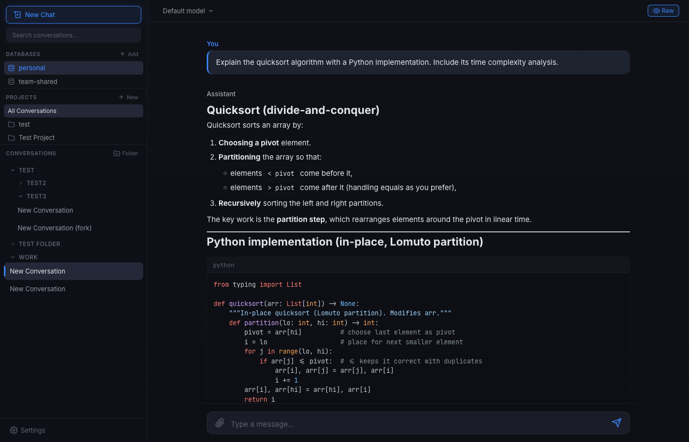
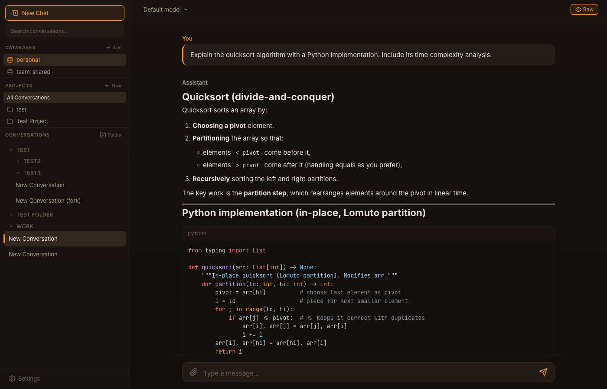
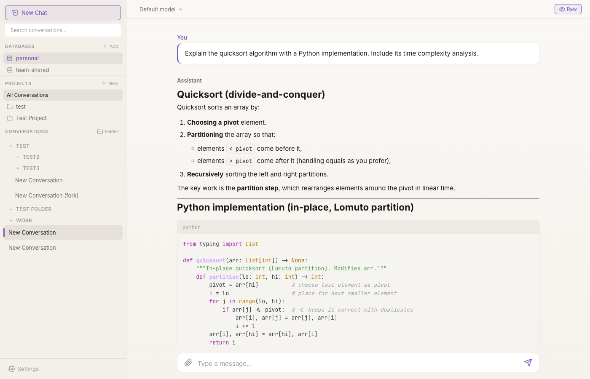
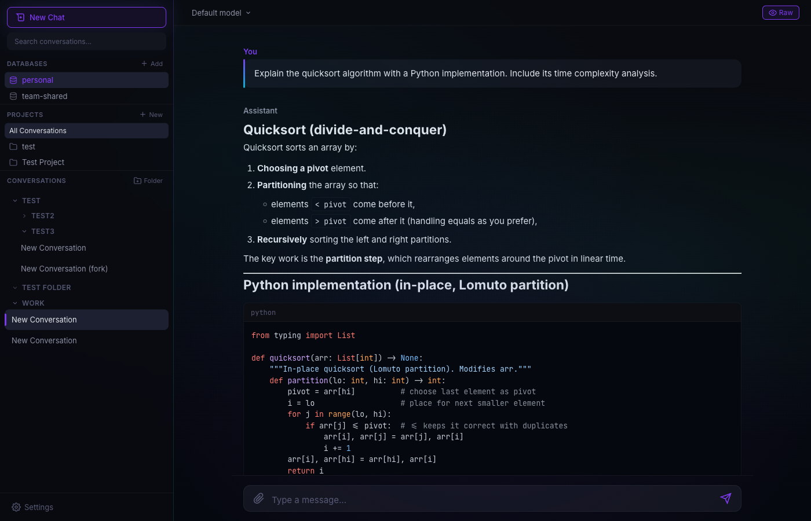

<p align="center">
  
</p>

<h1 align="center">Anteroom</h1>

<p align="center">
  <em>Your employees are already using ChatGPT. Your compliance team doesn't know.</em>
</p>

<p align="center">
  <strong>Give your whole org AI &mdash; without giving up control.</strong>
</p>

<p align="center">
  Self-hosted AI gateway. Web UI + agentic CLI. Any LLM. No telemetry.<br>
  <code>pip install anteroom</code>
</p>

<p align="center">
  
  
  <a href="https://codecov.io/gh/troylar/anteroom"></a>
  
  
</p>

<p align="center">
  <a href="https://anteroom.readthedocs.io">Docs</a> &bull;
  <a href="#get-running-in-60-seconds">Quick Start</a> &bull;
  <a href="#why-anteroom">Why Anteroom?</a> &bull;
  <a href="https://anteroom.readthedocs.io/en/latest/advanced/changelog/">Changelog</a>
</p>

<br>

<p align="center">
  
</p>

<br>

---

<br>

## The backstory

I'm a CTO at a Fortune 500 in a regulated industry where we can't use third-party AI tools &mdash; no ChatGPT, no Claude Code, no Cursor, no Copilot. But we *can* `pip install` open-source packages.

So I built Anteroom: a self-hosted AI gateway with a polished web UI for everyone on the team and an agentic CLI for developers. It connects to **any OpenAI-compatible API** &mdash; Azure OpenAI, Ollama, LM Studio, or your company's internal endpoint. Zero telemetry, no phone-home &mdash; data only goes to the LLM endpoint you choose. Go fully offline with local models.

JPMorgan built a private AI gateway for 250,000 employees. Goldman Sachs built one for 46,500. Anteroom gives every regulated institution the same capability &mdash; without a nine-figure technology budget.

<br>

---

<br>

## Why Anteroom?

**38% of employees paste confidential data into unauthorized AI tools.** Marketing teams, executives, and product owners are the worst offenders &mdash; not developers. Shadow AI breaches cost $650K+ per incident.

Cloud-hosted AI sends your data to third parties. Self-hosted chat UIs can't actually *do* anything. Building a custom platform costs millions.

Anteroom threads the needle:

| Problem | Anteroom |
|---------|----------|
| "AI tools send our data to the cloud" | Self-hosted. Zero telemetry. Data only goes to the endpoint you choose. |
| "Chat AI can't actually do things" | Agentic: edits files, runs commands, generates documents, creates presentations |
| "Our compliance team won't approve it" | OWASP ASVS L2 security, HMAC-chained audit logs, DLP, bash sandboxing |
| "It only works for developers" | Web UI for everyone + CLI for developers, same governed platform |
| "We can't control costs at scale" | Token budgets per-request, per-user, per-day |
| "We're locked into one AI vendor" | Any OpenAI-compatible API &mdash; Azure, Ollama, local models |
| "It takes months to deploy" | `pip install anteroom && aroom init` &mdash; done in 60 seconds |

<br>

---

<br>

## Get running in 60 seconds

```bash
pip install anteroom
aroom init          # interactive setup wizard
aroom               # web UI at http://127.0.0.1:8080
```

That's it. No Docker. No database server. No config files required.

Or use the CLI directly:

```bash
aroom chat                              # interactive REPL
aroom exec "summarize this PR" --json   # one-shot for scripts
```

<br>

---

<br>

## Two interfaces, one engine

Everything is shared &mdash; conversations, tools, storage, security controls, audit trail. The web UI serves the whole organization. The CLI serves developers who want agentic power tools.

<br>

### Web UI

A full-featured chat interface with projects, folders, tags, file attachments, canvas panels, inline tool approvals, and four built-in themes. Product owners, executives, compliance officers, and marketing teams use this.

<p align="center">
  &nbsp;&nbsp;
  
</p>
<p align="center">
  &nbsp;&nbsp;
  
</p>

<br>

### CLI REPL

An agentic terminal with **12 built-in tools** (+ 3 optional MS Office tools), MCP integration, sub-agent orchestration, a skills system, and planning mode &mdash; all with Rich markdown rendering.

```
$ aroom chat

anteroom v1.85.0 — the secure AI gateway
  model: gpt-4o | tools: 12 built-in + 3 MCP | safety: ask_for_writes

> Refactor the auth module to use JWT tokens

  Thinking... (12s)

  I'll break this into steps:
  1. Read the current auth implementation
  2. Design the JWT token flow
  3. Implement and test

  read_file  src/auth.py                        ✓
  read_file  src/middleware.py                   ✓
  edit_file  src/auth.py  (+42 -18)             ✓  ⚠ requires approval
  edit_file  src/middleware.py  (+15 -8)        ✓
  bash       pytest tests/unit/test_auth.py     ✓  12 passed

  Done. Refactored auth to use JWT with RS256 signing.
  See the changes in src/auth.py and src/middleware.py.

>
```

<br>

### Exec mode

Non-interactive mode for scripts, CI/CD, and automation:

```bash
aroom exec "summarize this PR" --json          # structured output
aroom exec "run tests and fix failures" --timeout 300
echo "review this" | aroom exec - --quiet      # pipe stdin
```

<br>

---

<br>

## Key capabilities

### Agentic, not just chat

The AI reads files, edits code, runs commands, searches your codebase, generates documents, creates presentations, and spawns parallel sub-agents &mdash; with safety gates at every step.

**Built-in tools:** `read_file` `write_file` `edit_file` `bash` `glob_files` `grep` `create_canvas` `update_canvas` `patch_canvas` `run_agent` `ask_user` `introspect`

**Optional tools** (install with `pip install anteroom[office]`): `docx` `xlsx` `pptx` &mdash; create, read, and edit Word, Excel, and PowerPoint files directly

---

### Packs: shareable AI capabilities

Packs are versioned, git-distributed bundles with **7 artifact types**: skills, tools, prompts, templates, hooks, configs, and docs. Build a "compliance pack" with regulatory prompts, a "marketing pack" with brand guidelines, a "DevOps pack" with deployment skills &mdash; and share them across teams.

```bash
aroom pack install https://github.com/example/compliance-pack
aroom pack list
```

Packs use a 6-layer precedence system (built-in &rarr; global &rarr; space &rarr; project &rarr; conversation &rarr; runtime) so departments can customize without weakening security controls.

---

### Spaces: named workspaces

Spaces bundle repositories, tools, configs, and packs into named workspaces. Different teams, different projects, different configurations &mdash; centrally governed.

```bash
aroom space create my-project --repo ./frontend --repo ./backend
aroom space switch my-project
```

---

### Enterprise-grade security

Built to [OWASP ASVS Level 2](SECURITY.md) standards. Not bolted on &mdash; baked in.

- **Tool safety gate**: 4 risk tiers, 4 approval modes, 3 permission scopes
- **16 hard-block patterns**: Catastrophic commands blocked unconditionally
- **Bash sandboxing**: Execution timeouts, output limits, path/command blocking, network restrictions
- **Prompt injection defense**: Trust classification, defensive XML envelopes, tag breakout prevention
- **Tamper-evident audit log**: HMAC-SHA256 chained JSONL, daily rotation, content redaction, SIEM-ready
- **Session hardening**: Ed25519 identity, concurrent session limits, IP allowlisting
- **Token budgets**: Per-request, per-conversation, per-day limits (cost governance at scale)
- **Sub-agent isolation**: Concurrency, depth, iteration, timeout, and output caps
- **Team config enforcement**: Lock security settings across the entire organization
- **DLP**: Configurable data loss prevention rules

---

### Works with any LLM

Any endpoint that speaks the OpenAI protocol, plus 100+ providers via LiteLLM:

- **Azure OpenAI** &mdash; your enterprise deployment
- **OpenAI** &mdash; GPT-4o, o1, o3, etc.
- **Anthropic** &mdash; Claude 3.5 Sonnet, Opus, Haiku
- **OpenRouter** &mdash; access 50+ open models (Llama, Mixtral, etc.) with one API key
- **Ollama / LM Studio** &mdash; fully offline, fully private
- **vLLM / TGI** &mdash; self-hosted open models
- **Replicate, Together, Cohere, Bedrock** &mdash; via LiteLLM (`pip install anteroom[providers]`)
- **Any OpenAI-compatible API**

---

### Extensible via MCP

Connect any [Model Context Protocol](https://modelcontextprotocol.io/) server. Databases, APIs, file systems, internal services &mdash; with per-server trust levels and tool filtering.

```yaml
# config.yaml
mcp_servers:
  - name: internal-tools
    command: npx
    args: ["-y", "@my-org/internal-tools"]
    trust_level: trusted
  - name: external-api
    command: npx
    args: ["-y", "@third-party/api"]
    trust_level: untrusted
```

---

### Planning mode

For complex tasks, the AI explores first, writes a plan, then executes only after you approve. Works in both CLI and web UI.

```
> /plan build a REST API for user management
  Planning... reading codebase, designing approach

> /plan approve
  Executing plan: 8 steps across 5 files...
```

---

### Knowledge sources

Upload documents (PDFs, DOCX, code) via CLI or web UI drag-and-drop. Text is automatically extracted and indexed for semantic search with local vector embeddings &mdash; no external API needed.

```bash
pip install anteroom[docs]        # adds PDF/DOCX text extraction
pip install anteroom[embeddings]  # adds local vector search
```

<br>

---

<br>

## The full picture

| | |
|---|---|
| **Web UI** | Conversations, projects, folders, tags, attachments, canvas, themes, keyboard shortcuts |
| **CLI** | REPL, one-shot, exec mode, planning, skills, @file references, Rich rendering |
| **Tools** | 12 built-in + 3 optional office tools + unlimited MCP tools, parallel execution, sub-agents |
| **Packs** | 7 artifact types, 6-layer precedence, git distribution, lock files, health checks |
| **Spaces** | Workspace management, auto-discovery, repository cloning, per-space config overlays |
| **Security** | OWASP ASVS L2, CSRF, CSP, HSTS, SRI, rate limiting, DLP, prompt injection defense |
| **Audit** | HMAC-SHA256 chained JSONL, daily rotation, content redaction, SIEM integration |
| **Storage** | SQLite + FTS5 + optional vector search, fully local, optional SQLCipher encryption |
| **Config** | YAML + env vars, ANTEROOM.md conventions, team enforcement, dynamic API key refresh |

<br>

---

<br>

## Development

```bash
git clone https://github.com/troylar/anteroom.git
cd anteroom && pip install -e ".[dev]"
pytest tests/ -v                    # 6000+ tests
ruff check src/ tests/              # lint
ruff format src/ tests/             # format
```

**Stack:** Python 3.10+ &bull; FastAPI &bull; SQLite &bull; Vanilla JS &bull; Rich &bull; prompt-toolkit &bull; OpenAI SDK &bull; MCP SDK

<br>

---

<br>

## Contributing

See [CONTRIBUTING.md](CONTRIBUTING.md) for architecture overview, dev setup, and contribution guidelines. Packs are the easiest way to contribute &mdash; no core changes needed.

<br>

---

<br>

<p align="center">
  <strong>Apache License 2.0</strong> &mdash; free to use, modify, and distribute<br>
  <br>
  An <em>anteroom</em> is the private chamber just outside a larger hall &mdash;<br>
  a controlled space where you decide who enters and what leaves.<br>
  <br>
  <a href="https://anteroom.readthedocs.io">anteroom.readthedocs.io</a> &bull;
  <a href="https://anteroom.ai">anteroom.ai</a>
</p>
